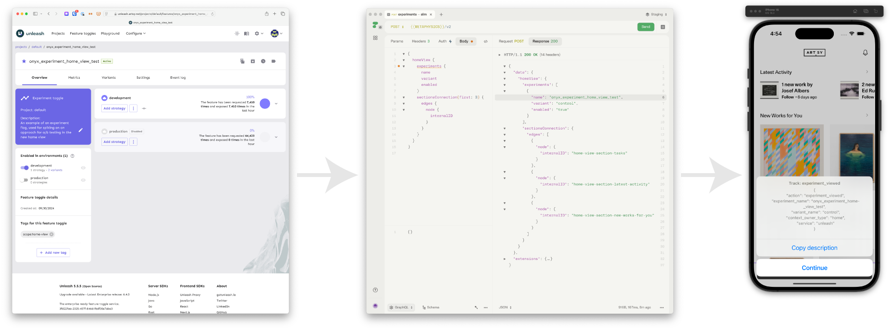

# Adding a new Home View Experiment

> [!NOTE]
> The pattern for home view experiments was shared at the 31:45 minute mark
> in this demo on 2024-11-08:
>
> 👉🏽 [Archived demo video][demo_video]

We have developed a pattern for defining home view A/B tests that are driven
from the server, just as home view _content_ is now driven from the server.

This allows us to define experiments and record `experiment_viewed` events in
the client in such a way that does not require making any client-side changes.

To put it another way…



…all without touching Eigen.

## Server-side or client-side experiment?

The first question to consider is if the experiment _should_ be declared here in
MP -vs- over in the client, as has typically been the case up till now.

Many experiments such as A/B tests of UI component variations — even when
those components are present in the home view — will continue to be set up on
the client, in the conventional way ([example][save_follow_ab_test]).

But if the test has to do with variations that pertain purely to the
server-driven home view, e.g…

- the ordering of home view sections
- the conditional presence or absence of home view sections
- variations in algorithms that populate the data destined for home view sections

…then a home view experiment as defined here may be justified.

## Define your experiment in Unleash

In Unleash lingo you will be setting up a new **Feature toggle** of type:
**Experiment**

Follow our documentation elsewhere (e.g [this Force doc][force_ab_docs]) for
doing that via the Unleash UI or via the streamlined version within Forque.
The process for this is basically the same as for any other kind of A/B test.

The example we set up for demonstration purposes (and which we'll use
in the code snippets below) was:

👉🏽 [onyx_experiment_home_view_test][onyx_experiment_home_view_test]

## Wire up the experiment to the home view

### 1. Add the new feature toggle (aka feature flag) to Metaphysics

Do so by adding it to the `FEATURE_FLAGS_LIST` in [lib/featureFlags][feature_flags]

(Note: this list contains both release toggles as well as experiment
toggles — all good.)

```ts
const FEATURE_FLAGS_LIST = [
  //...
  "onyx_experiment_home_view_test",
] as const
```

### 2. Declare it as a home view experiment in [homeView/experiments][home_view_experiments_list]

```ts
export const CURRENTLY_RUNNING_EXPERIMENTS: FeatureFlag[] = [
  //...
  "onyx_experiment_home_view_test",
]
```

That's it — Metaphysics will now include the experiment and the current user's
assigned variant in the `homeView.experiments` field, so long as this experiment
is enabled in Unleash and included in this list.

## Confirm the experiment is now in the `homeView` response

At this point you should be able to issue a `homeView` query and see
the `experiments` field in the response.

```graphql
{
  homeView {
    experiments {
      name
      variant
    }
    sectionsConnection(first: 10) {
      # ...
    }
  }
}

```

```json
{
  "data": {
    "homeView": {
      "experiments": [
        {
          "name": "onyx_experiment_home_view_test",
          "variant": "control"
        }
      ],
      "sectionsConnection": {
        // ...
      }
    }
  }
}
```

## Confirm the experiment tracking in the client

Eigen is already equipped to request and process this `homeView.experiments`
data, emitting the necessary tracking events.

This can be confirmed using the usual analytics inspectors such as the
Segment debugger or the Eigen analytics visualizer.

To note: the corresponding `experiment_viewed` is expected to fire exactly once
per session, on the initial load of the home view. It will not be deferred until
any specific section scrolls into view, nor will it be re-fired upon return to
the home screen.

<!-- links -->

[demo_video]: https://drive.google.com/drive/u/1/folders/1p4ZQdDq5Rs3ROhV9U6dltCZikrJkjWVy
[demo_archive]: https://artsy.slack.com/archives/C07ANEV7RNV/p1731082451967609
[save_follow_ab_test]: https://github.com/artsy/eigen/pull/11062
[onyx_experiment_home_view_test]: https://unleash.artsy.net/projects/default/features/onyx_experiment_home_view_test
[force_ab_docs]: https://github.com/artsy/force/blob/main/docs/unleash_a-b_testing.md
[feature_flags]: ../src/lib/featureFlags.ts
[home_view_experiments_list]: ../src/schema/v2/homeView/experiments/experiments.ts
