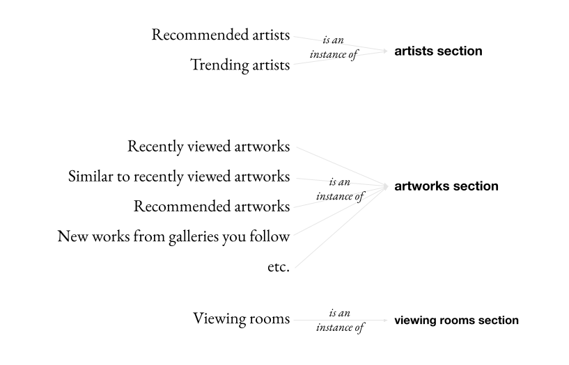

# Adding a new Home View Section

> [!NOTE]
> The new dynamic home view and its associated schema was discussed in an
> Engineering Knowledge Share presentation on 2024-09-25.
>
> Check it out for a visual, hands-on intro:
>
> 👉🏽 [Archived presentation video and slides][ks_archive]

In order to add to the home view schema, we should think in terms of **section instances** and **section types**, as indicated by [this slide from the KS][ks_slide_instances_types].

<a href="https://docs.google.com/presentation/d/1j9yFZmkdelJ6y3YQiuJ-KaUTv0Pc9-ZwyTdrR5HrU9Q/edit#slide=id.g3024881a6d2_1_126"></a>

If you want to add a new section _instance_, you should first check to see if there is an existing section _type_ that returns the same kind of data.

If there is one, you can skip to Step 3.

Else, you'll need to create the new section type:

## Define your new section _type_

> [!NOTE]
> See also [related slide][ks_slide_new_section_type] and 33:00 in the [video][ks_archive]

### 1. Create the new section type in [homeView/sectionTypes/][section_type_declarations]

You will first need to define a name for the section type, in the [sectionTypes/names][section_type_names] file

Then copy the annotated [`ExampleSectionType`][example_section_type_declaration] file, customizing the values and removing the comments as you go.

```typescript
const HomeViewSectionMyNewType = new GraphQLObjectType<any, ResolverContext>({
  name: HomeViewSectionTypeNames.HomeViewSectionMyNewType,
  description: "A description of your new section type",
  interfaces: [HomeViewGenericSectionInterface, NodeInterface],
  fields: {
    ...standardSectionFields,

    // 👇 Add your new field (often a connection) here
    myNewField: MyNewFieldType,
  },
})
```

### 2. Add your new section type to [`sectionTypes/index`][section_types_list]

```typescript
export const homeViewSectionTypes: GraphQLObjectType<any, ResolverContext>[] = [
  //...

  HomeViewSectionMyNewType, // 👈 Add your new type here, in alphabetical order

  //...
]
```

You should now have a commit that looks something like [this][gh_new_section_type_commit] (although the folder structure may be different nowadays).

## Define your new section _instance_

### 3. Define section logic in [homeView/sections/][section_instance_declarations]

> [!NOTE]
> See also [related slide][ks_slide_new_section_instance] and 09:50 in the [video][ks_archive]

Start by copying the annotated [`ExampleSection`][example_section_declaration] file, customizing the values and removing the comments as you go.

Your section declaration at a minimum will look something like:

```typescript
export const MyNewSection: HomeViewSection = {
  id: "home-view-section-[name-of-the-new-section]",
  type: HomeViewSectionTypeNames.HomeViewSectionMyNewType,
  component: {
    title: "My New Section",
  },
  requiresAuthentication: true,
  resolver: withHomeViewTimeout(async (parent, args, context, info) => {
    // Add your resolver logic here
  }),
}
```

> [!TIP]
> Consider using the built-in support for Unleash flags so as to avoid expose the new section prematurely.

### 4. Add your new section to the [section registry][section_instance_registry]

```ts
const sections: HomeViewSection[] = [
  //...

  MyNewSection, // 👈 Add your new section here, in alphabetical order

  //...
]
```

This is what will allow you to query it directly by `id` from GraphQL:

```graphql
{
  homeView {
    section(id: "home-view-section-[name-of-the-new-section]") {
      __typename
      internalID
      # …
    }
  }
}
```

You should now have a commit that looks something like [this][gh_new_section_instance_commit] (although the folder structure may be different nowadays).

### 5. Expose your section in the appropriate zone

> [!NOTE]
> As of this writing, only the default zone (formerly known as the legacy zone) is supported.

Add your new section to the `SECTIONS` array in the [default zone][default_zone] and define the order you want to display it at.

```typescript
const SECTIONS: HomeViewSection[] = [
  //...

  MyNewSection, // 👈 Insert your new section into the desired position

  //...
]
```

This will allow you to query the entire list of home view sections and see your new section in its correct place:

```graphql
{
  homeView {
    sectionsConnection(first: 30) {
      edges {
        node {
          __typename
          internalID
          # …
        }
      }
    }
  }
}
```

You should now have a commit that looks something like [this][gh_expose_section_commit] (although the folder structure may be different nowadays).

### 6. Add a test for your new section

Our pattern is to write a test for each new section to verify that it correctly returns its _metadata_ (section type, name, analytics, e.g.) and _data_ (a connection of artworks or artists, e.g).

We don't write tests for the abstract section **types**, preferring instead to test them via their concrete section **instances**.

Thus you can see that each section declared in [`homeView/sections`][section_instance_declarations] has a corresponding test in [`homeView/sections/__tests__`][section_instance_specs].

Please continue this pattern as you add new sections.

## Finally

If you want to see how this all comes together, check out [this branch from the KS][gh_new_section_type_and_instance_branch]

If you have any questions, drop them in #dev-help as usual!

<!-- repo file links -->

[section_type_names]: ../src/schema/v2/homeView/sectionTypes/names.ts
[section_type_declarations]: ../src/schema/v2/homeView/sectionTypes/
[section_types_list]: ../src/schema/v2/homeView/sectionTypes/index.ts
[section_instance_declarations]: ../src/schema/v2/homeView/sections
[section_instance_specs]: ../src/schema/v2/homeView/sections/__tests__
[example_section_declaration]: ../src/schema/v2/homeView/sections/_ExampleSection.ts
[example_section_type_declaration]: ../src/schema/v2/homeView/sectionTypes/_ExampleSectionType.ts
[section_instance_registry]: ../src/schema/v2/homeView/sections/index.ts
[default_zone]: ../src/schema/v2/homeView/zones/default.ts

<!-- KS links -->

[ks_archive]: https://drive.google.com/drive/folders/1C8bCSC4O6DhvczxwiPVclvX5_9b9QNV2?usp=share_link
[ks_video]: https://drive.google.com/drive/folders/1C8bCSC4O6DhvczxwiPVclvX5_9b9QNV2?usp=share_link
[ks_slide_instances_types]: https://docs.google.com/presentation/d/1j9yFZmkdelJ6y3YQiuJ-KaUTv0Pc9-ZwyTdrR5HrU9Q/edit#slide=id.g3024881a6d2_1_126
[ks_slide_new_section_instance]: https://docs.google.com/presentation/d/1j9yFZmkdelJ6y3YQiuJ-KaUTv0Pc9-ZwyTdrR5HrU9Q/edit#slide=id.g304a7fb6f10_1_15
[ks_slide_new_section_type]: https://docs.google.com/presentation/d/1j9yFZmkdelJ6y3YQiuJ-KaUTv0Pc9-ZwyTdrR5HrU9Q/edit#slide=id.g304a7fb6f10_1_23

<!-- sample commit links -->

[gh_new_section_type_commit]: https://github.com/artsy/metaphysics/commit/34dd1ddf195da8bb8a842e7e5b2b3bf77cf5f8be
[gh_new_section_instance_commit]: https://github.com/artsy/metaphysics/commit/98c9acec51ab2f4c9c0ec8d2e24c66c1219fe5c0
[gh_expose_section_commit]: https://github.com/artsy/metaphysics/commit/613415ec88cb79f81e011ce7389b1f97eafa0149
[gh_new_section_type_and_instance_branch]: https://github.com/artsy/metaphysics/compare/main...onyx/home-view-ks-demo-new-section-type
