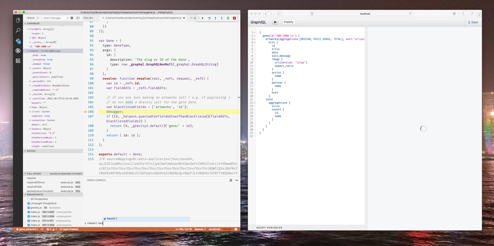

### VS Code

If you want an overview of how VS Code differs from traditional TextMate clones, read Orta's [post on the Artsy blog](http://artsy.github.io/blog/2016/08/15/vscode/).

## Types

We get partial typing by default through Flow, and the graphql module by default.

To get more extensive typing you need to install [flow-typed](https://github.com/flowtype/flow-typed), via `yarn global add flow-typed`. Then run `flow-typed install` in the root directory.

## Running Metaphysics

You can _optionally_ run Metaphysics inside your editor, this is done via the task "Start Node Foreman in Dev". To run it trigger "Build Mode" in VS Code (defaults to `cmd + shift + b`.) To close the server, either close the window - or run the command "Tasks: Terminate running tasks".

## Debugging Metaphysics

This repo uses babel at runtime via `require('babel-core/register');` and so there are no source-mapping files, this means that VS Code does not support LOC breakpoints from your source code into the real transpiled code in Metaphysics.

You can work around this though [using the `debugger()` function](https://developers.google.com/web/tools/chrome-devtools/console/command-line-reference?hl=en#debugfunction) inside your source code instead.

To start the debugger, run the debugger (VS Code defaults this to `f5`, I typically re-bind this to `cmd + r`) and the bar at the bottom should turn orange. Then in the LOC you want to debug inside, add `debugger;`. This will open the transpiled source code, and on the left in the debugger menu you can see all of the state, and the console should work at the bottom.

### Related Tangentially

There is more information about using VS Code, with terminology and keybinding recommendations, inside [the Emission repo](https://github.com/artsy/emission/blob/master/docs/vscode.md).