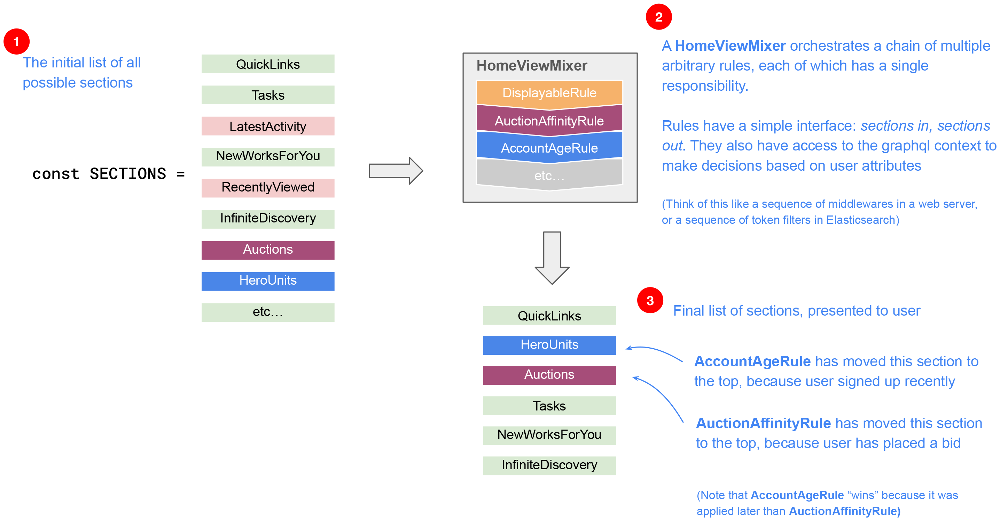
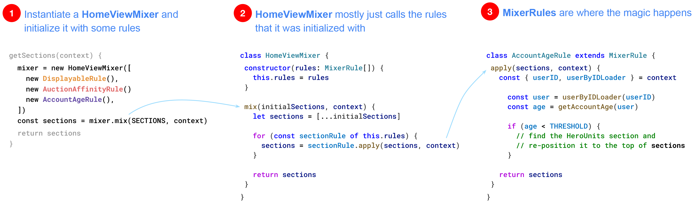

# The Home View Mixer

In 2025 we introduced a pattern that allows us to re-order the content within
an Eigen user's home view based on arbitrary rules that can consider the
request context and user attributes.

It was discussed [here](https://artsy.slack.com/archives/C05EQL4R5N0/p1745488800435159)
and can be summarized as follows.

## Flow

A `HomeViewMixer` ([source](/src/schema/v2/homeView/mixer/HomeViewMixer.ts)) is associated with one or more `HomeViewMixerRule`s ([source](/src/schema/v2/homeView/mixer/HomeViewMixerRule.ts))

Each `HomeViewMixerRule` can take an incoming list of home view sections, transform it in any way, and return the resulting list of sections.

Multiple rules can be chained together, via a `HomeViewMixer`, whose purpose is to orchestrate the execution of those rules.

This illustrates the logic, with some hypothetical rules:



> [!NOTE]
> In fact those hypothetical were inspired by the actual rules we later added with [`BoostHeroUnitsForNewUsersRule`](https://github.com/artsy/metaphysics/pull/6677/commits/fcd3b2bb5ce9963f285e6a5f4380803026348eb8) and [`AuctionEngagementRule`](https://github.com/artsy/metaphysics/pull/6732)

## Code

Here is a simplified view of how `HomeViewMixer`
and `HomeViewMixerRule` can be used:



## How to add a new rule

That `getSections` method reference in step 1 above currently resides in [`homeView/zones/default.ts`](/src/schema/v2/homeView/zones/default.ts)

Since it already instantiates a `HomeViewMixer` all you need to do is:

1. Create a new rule that extends `HomeViewMixerRule` and implements its `apply` method

```ts
export class MyAmazingNewRule extends HomeViewMixerRule {
  async apply(
    sections: HomeViewSection[],
    context: ResolverContext
  ): Promise<HomeViewSection[]> {
    const { userID, etc } = context

    if (someCondition) {
      // do something to `sections`
    }

    return sections
  }
}
```

2. Write a test for it

3. Import and add it to the `HomeViewMixer` instance in `homeView/zones/default.ts`

```ts
async function getSections(context: ResolverContext) {
  const mixer = new HomeViewMixer([
    new DisplayableRule(),
    new AuctionEngagementRule(),
    new MyAmazingNewRule(), // 👈🏽👈🏽👈🏽 added
  ])

  return await mixer.mix(SECTIONS, context)
}
```

Note that the order of execution of rules influences the final section ordering, so you may want to insert your rule at the end of the chain or somewhere else, depending on your needs.

> [!TIP]
> An example PR that does all of this is https://github.com/artsy/metaphysics/pull/6732, which introduced the `AuctionEngagementRule`. Feel free to follow the patterns there for implementing and testing your rule.
